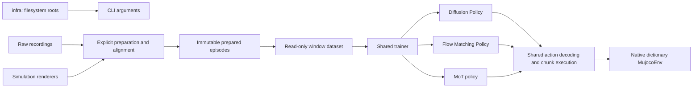

# Policy and training redesign

**Design proposal, stacked on PR #3.** This change specifies the architecture and
implementation sequence; it does not add placeholder policies, a trainer, new
runtime dependencies, or claim trained results. The three implementations should
be built against this shared contract after review.

The user requirement is explicit: **no language inputs and no language-model
weights**, including for the π0.5-style policy. Infrastructure remains separate.

The proposed system has two action-generation objectives and two architectures:

| User-facing policy | Action network | Training objective |
| --- | --- | --- |
| Diffusion Policy | Conditional temporal U-Net | DDPM noise prediction |
| Flow Matching Policy | The same conditional U-Net | Conditional flow matching |
| MoT policy | Observation and action transformer experts | The same flow matching |

This keeps DP versus FM a controlled objective comparison. MoT is a separate
architecture comparison, not a third training pipeline. It is inspired by the
π0.5 action-expert architecture, not a reproduction of its language system,
pretraining mixture, scale, or published performance.

- [Policy design and research](docs/POLICIES.md): objectives, MoT structure,
  interfaces, representation and sampling.
- [Data and rendering design](docs/DATA.md): timing, prepared episodes, data loading,
  render variants, and the recording limitation discovered in PR #3.
- [Training and implementation plan](docs/TRAINING.md): module ownership,
  dependencies, checkpoints, validation and bounded implementation slices.

We restart the old training implementation. We retain its useful requirements:
multiview observations, observation history, action chunks, visual variants,
replay-based rendering, validation and resumption. We do not retain network I/O
inside Dataset, mutable global configuration, queues inside rendering, action
shifts hidden in indexing, policy-owned optimizers, or parallel cache formats.
